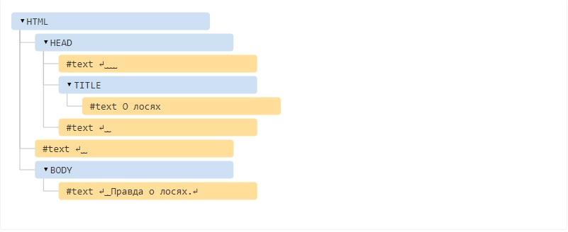

# DOM-дерево

#### [DOM-дерево](https://learn.javascript.ru/dom-nodes)

Основой HTML-документа являются теги.

В соответствии с объектной моделью документа («Document Object Model», коротко DOM), каждый HTML-тег является объектом. Вложенные теги являются «детьми» родительского элемента. Текст, который находится внутри тега, также является объектом.

Все эти объекты доступны при помощи JavaScript, мы можем использовать их для изменения страницы.

Например, `document.body` – объект для тега `<body>`.

Если запустить этот код, то `<body>` станет красным на 3 секунды:

    document.body.style.background = 'red'; // сделать фон красным

    setTimeout(() => document.body.style.background = '', 3000); // вернуть назад

### Пример DOM

Начнём с такого, простого, документа:

    <!DOCTYPE HTML>
    <html>
    <head>
      <title>О лосях</title>
    </head>
    <body>
      Правда о лосях.
    </body>
    </html>

DOM – это представление HTML-документа в виде дерева тегов. Вот как оно выглядит:

Каждый узел этого дерева – это объект.

Теги являются узлами-элементами (или просто элементами). Они образуют структуру дерева: `<html>` – это корневой узел, `<head>` и `<body>` его дочерние узлы и т.д.

Текст внутри элементов образует текстовые узлы, обозначенные как `#text`. Текстовый узел содержит в себе только строку текста. У него не может быть потомков, т.е. он находится всегда на самом нижнем уровне.

Например, в теге `<title>` есть текстовый узел `"О лосях"`.

Обратите внимание на специальные символы в текстовых узлах:

- перевод строки: `↵` (в JavaScript он обозначается как `\n`)
- пробел: `␣`

Пробелы и переводы строки – это полноправные символы, как буквы и цифры. Они образуют текстовые узлы и становятся частью дерева DOM. Так, в примере выше в теге `<head>` есть несколько пробелов перед `<title>`, которые образуют текстовый узел `#text` (он содержит в себе только перенос строки и несколько пробелов).

Существует всего два исключения из этого правила:

1. По историческим причинам пробелы и перевод строки перед тегом `<head>` игнорируются
2. Если мы записываем что-либо после закрывающего тега `</body>`, браузер автоматически перемещает эту запись в конец `body`, поскольку спецификация HTML требует, чтобы всё содержимое было внутри `<body>`. Поэтому после закрывающего тега `</body>` не может быть никаких пробелов.

В остальных случаях всё просто – если в документе есть пробелы (или любые другие символы), они становятся текстовыми узлами дерева DOM, и если мы их удалим, то в DOM их тоже не будет.

Здесь пробельных текстовых узлов нет:

    <!DOCTYPE HTML>
    <html><head><title>О лосях</title></head><body>Правда о лосях.</body></html>

**Пробелы по краям строк и пробельные текстовые узлы скрыты в инструментах разработки**

Когда мы работаем с деревом DOM, используя инструменты разработчика в браузере (которые мы рассмотрим позже), пробелы в начале/конце текста и пустые текстовые узлы (переносы строк) между тегами обычно не отображаются.

Таким образом инструменты разработки экономят место на экране.

### Автоисправление

Если браузер сталкивается с некорректно написанным HTML-кодом, он автоматически корректирует его при построении DOM.

Например, в начале документа всегда должен быть тег `<html>`. Даже если его нет в документе – он будет в дереве DOM, браузер его создаст. То же самое касается и тега `<body>`.

**Таблицы всегда содержат `<tbody>`**

Важный «особый случай» – работа с таблицами. По стандарту DOM у них должен быть `<tbody>`, но в HTML их можно написать (официально) без него. В этом случае браузер добавляет `<tbody>` в DOM самостоятельно.

### Другие типы узлов

Есть и некоторые другие типы узлов, кроме элементов и текстовых узлов.

Например, узел-комментарий:

    <!DOCTYPE HTML>
    <html>
    <body>
      Правда о лосях.
      <ol>
        <li>Лось -- животное хитрое</li>
        <!-- комментарий -->
        <li>...и коварное!</li>
      </ol>
    </body>
    </html>

**Все, что есть в HTML, даже комментарии, является частью DOM.**

Даже директива `<!DOCTYPE...>`, которую мы ставим в начале HTML, тоже является DOM-узлом. Она находится в дереве DOM прямо перед `<html>`. Мы не будем рассматривать этот узел, мы даже не рисуем его на наших диаграммах, но он существует.

Даже объект `document`, представляющий весь документ, формально является DOM-узлом.

Существует [12 типов узлов](https://dom.spec.whatwg.org/#node). Но на практике мы в основном работаем с 4 из них:

1. `document` – «входная точка» в DOM.
2. узлы-элементы – HTML-теги, основные строительные блоки.
3. текстовые узлы – содержат текст.
4. комментарии – иногда в них можно включить информацию, которая не будет показана, но доступна в DOM для чтения JS.

### Взаимодействие с консолью

При работе с DOM нам часто требуется применить к нему JavaScript. Например: получить узел и запустить какой-нибудь код для его изменения, чтобы посмотреть результат. Вот несколько подсказок, как перемещаться между вкладками Elements и Console.

Последний элемент, выбранный во вкладке Elements, доступен в консоли как `$0`; предыдущий, выбранный до него, как `$1` и т.д.

Теперь мы можем запускать на них команды. Например `$0.style.background = 'red'` сделает выбранный элемент красным.

Это мы посмотрели как получить узел из Elements в Console.

Есть и обратный путь: если есть переменная `node`, ссылающаяся на DOM-узел, можно использовать в консоли команду `inspect(node)`, чтобы увидеть этот элемент во вкладке Elements.

Или мы можем просто вывести DOM-узел в консоль и исследовать «на месте», как `document.body`

### Итого

HTML/XML документы представлены в браузере в виде DOM-дерева.

- Теги становятся узлами-элементами и формируют структуру документа.
- Текст становится текстовыми узлами.
- … и т.д. Всё, что записано в HTML, есть и в DOM-дереве, даже комментарии.

Для изменения элементов или проверки DOM-дерева мы можем использовать инструменты разработчика в браузере.

Здесь мы рассмотрели основы, наиболее часто используемые и важные действия для начала разработки. Подробную документацию по инструментам разработки Chrome Developer Tools можно найти на странице https://developers.google.com/web/tools/chrome-devtools. Лучший способ изучить инструменты – походить по разным вкладкам, почитать меню: большинство действий очевидны для пользователя. Позже, когда вы немного их изучите, прочитайте документацию и узнайте то, что осталось.

У DOM-узлов есть свойства и методы, которые позволяют выбирать любой из элементов, изменять, перемещать их на странице и многое другое. Мы вернёмся к ним в последующих разделах.
