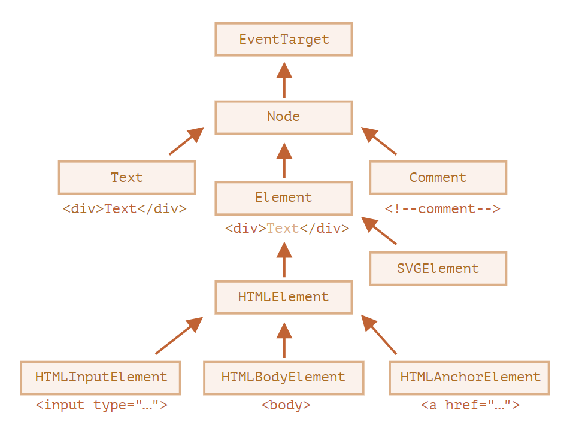

# Свойства узлов: тип, тег и содержимое

#### [Свойства узлов: тип, тег и содержимое](https://learn.javascript.ru/basic-dom-node-properties)

### Классы DOM-узлов

У разных DOM-узлов могут быть разные свойства. Например, у узла, соответствующего тегу `<a>`, есть свойства, связанные со ссылками, а у соответствующего тегу `<input>` – свойства, связанные с полем ввода и т.д. Текстовые узлы отличаются от узлов-элементов. Но у них есть общие свойства и методы, потому что все классы DOM-узлов образуют единую иерархию.

Каждый DOM-узел принадлежит соответствующему встроенному классу.

Корнем иерархии является [EventTarget](https://dom.spec.whatwg.org/#eventtarget), от него наследует [Node](https://dom.spec.whatwg.org/#interface-node) и остальные DOM-узлы.

На рисунке ниже изображены основные классы:

Существуют следующие классы:

- [EventTarget](https://dom.spec.whatwg.org/#eventtarget) – это корневой «абстрактный» класс для всего.

  Объекты этого класса никогда не создаются. Он служит основой, благодаря которой все DOM-узлы поддерживают так называемые «события», о которых мы поговорим позже.

- [Node](https://dom.spec.whatwg.org/#interface-node) – также является «абстрактным» классом, и служит основой для DOM-узлов.

  Он обеспечивает базовую функциональность: `parentNode`, `nextSibling`, `childNodes` и т.д. (это геттеры). Объекты класса `Node` никогда не создаются. Но есть определённые классы узлов, которые наследуются от него (и следовательно наследуют функционал `Node`).

- [Document](https://dom.spec.whatwg.org/#interface-document), по историческим причинам часто наследуется `HTMLDocument` (хотя последняя спецификация этого не навязывает) – это документ в целом.

  Глобальный объект document принадлежит именно к этому классу. Он служит точкой входа в DOM.

- [CharacterData](https://dom.spec.whatwg.org/#interface-characterdata) – «абстрактный» класс. Вот, кем он наследуется:

  - [Text](https://dom.spec.whatwg.org/#interface-text) – класс, соответствующий тексту внутри элементов. Например, `Hello` в `
Hello
`.
  - [Comment](https://dom.spec.whatwg.org/#interface-comment) – класс для комментариев. Они не отображаются, но каждый комментарий становится членом DOM.

- [Element](https://dom.spec.whatwg.org/#interface-element) – это базовый класс для DOM-элементов.

  Он обеспечивает навигацию на уровне элементов: `nextElementSibling`, `children`. А также и методы поиска элементов: `getElementsByTagName`, `querySelector`.

  Браузер поддерживает не только HTML, но также XML и SVG. Таким образом, класс `Element` служит основой для более специфичных классов: `SVGElement`, `XmlElement` (они нам здесь не нужны) и `HTMLElement`.

- И наконец, [HTMLElement](v) является базовым классом для всех остальных HTML-элементов. Мы будем работать с ним большую часть времени.

  От него наследуются конкретные элементы:

  - [HTMLInputElement](https://html.spec.whatwg.org/multipage/forms.html#htmlinputelement) – класс для тега `<input>`,
  - [HTMLBodyElement](v) – класс для тега `<body>`,
  - [HTMLAnchorElement](https://html.spec.whatwg.org/multipage/semantics.html#htmlanchorelement) – класс для тега `<a>`,
  - …и т.д.

Также существует множество других тегов со своими собственными классами, которые могут иметь определенные свойства и методы, в то время как некоторые элементы, такие как ``, `<section>` и `<article>`, не имеют каких-либо определенных свойств, поэтому они являются экземплярами класса `HTMLElement`.

Таким образом, полный набор свойств и методов данного узла является результатом цепочки наследования.

Рассмотрим DOM-объект для тега `<input>`. Он принадлежит классу [HTMLInputElement](https://html.spec.whatwg.org/multipage/forms.html#htmlinputelement).

Он получает свойства и методы из (в порядке наследования):

- `HTMLInputElement` – этот класс предоставляет специфичные для элементов формы свойства,
- `HTMLElement` – предоставляет общие для HTML-элементов методы (и геттеры/сеттеры),
- `Element` – предоставляет типовые методы элемента,
- `Node` – предоставляет общие свойства DOM-узлов,
- `EventTarget` – обеспечивает поддержку событий (поговорим о них дальше),
- …и, наконец, он наследует от `Object`, поэтому доступны также методы «обычного объекта», такие как `hasOwnProperty`.
